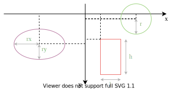
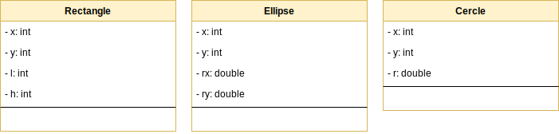
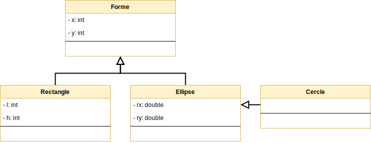
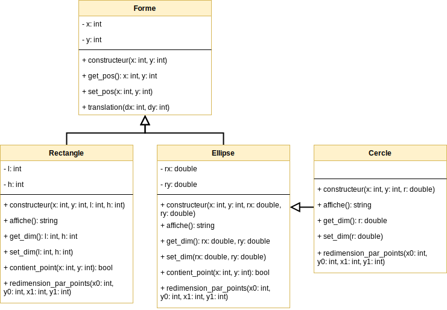
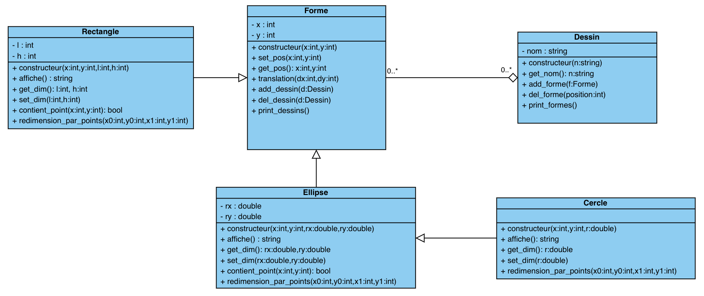

**Sommaire**

[[_TOC_]]

# TD #1 : Modélisation de formes géométriques

<p class=correction>
Ceci est la version enseignants incluant les corrections.
</p>

Le but de ce TD est d'illustrer les concepts d'encapsulation et d'héritage de la programmation objet, en concevant un module pour manipuler des formes géométriques avec Python. Vous commencerez par réaliser une modélisation objet du problème en définissant les classes et leurs attributs, puis implémenterez les méthodes en Python, et finalement les validerez avec des tests.


---
## Modélisation avec UML (1h30)

Les formes géométriques sont représentées par des classes, et l'héritage sera utilisé pour factoriser les propriétés communes. Nous nous limitons à un repère à deux dimensions orthonormé, avec les axes croissant vers la droite et le bas. Les coordonnées dans ce repère sont des entiers relatifs (c'est-à-dire possiblement négatifs). Dans cet espace, nous choisissons de représenter les formes suivantes :

* Les rectangles caractérisés par leur origine (`x`, `y`) et leurs dimensions (`l`, `h`).
* Les ellipses caractérisées par leur origine (`x`, `y`) et leurs rayons aux axes (`rx`, `ry`).
* Les cercles caractérisés par leur origine (`x`, `y`) et leur rayon.

<center></center>

__Exercice 1 -__ Représentez les 3 classes dans un diagramme de classes UML. Plusieurs outils, notamment en ligne, peuvent être utilisés pour cela, par exemple [Visual paradigm](https://online.visual-paradigm.com/fr/) ou encore [diagrams.net](https://app.diagrams.net). Pour vos diagrammes, il est recommandé de commencer les noms des classes par une majuscule et les attributs par une minuscule. Durant tout ce TD, on considérera uniquement des attributs privés.

<center class=correction><b>CORRECTION</b> </center>

Les attributs `x` et `y` étant partagés par les trois classes et le cercle étant un cas particulier d'ellipse, on introduit l'héritage pour les regrouper. Toutes les formes géométriques hériteront d'une même classe __Forme__, et le cercle héritera de l'ellipse. L'intérêt de ces relations d'héritage est double :

* Du point de vue des développeurs du module, les méthodes dont le code est identique entre formes (ex. translation) sont fusionnées dans __Forme__, réduisant la quantité de code à produire (et donc la multiplication des erreurs possibles).
* Du point de vue des utilisateurs du module, on peut écrire du code qui manipule des rectangles et des ellipses (*p. ex.* système de collisions de formes) sans avoir à écrire du code séparément pour les rectangles et les ellipses. 

__Exercice 2 -__ Mettez à jour le diagramme UML en incluant la classe __Forme__ et les relations d'héritage. Seuls les attributs seront inclus pour le moment.

<center class=correction><b>CORRECTION</b></center>

__Exercice 3 -__ On vous demande de supporter a minima pour chaque forme les méthodes suivantes :

* `translation(dx, dy)`, qui effectue une translation selon un vecteur donné.
* `contient_point(x, y)`, qui renvoie `True` si et seulement si le point donné est à l'intérieur de la forme ou sur sa frontière.
* `redimension_par_points(x0, y0, x1, y1)`, qui redimensionne la forme telle qu'elle soit incluse dans le rectangle de coins (`x0`, `y0`) et (`x1`, `y1`). Dans le cas du cercle, il faudra également qu'il soit le plus proche du premier coin. Cette méthode est utile par exemple dans [diagrams.net](https://app.diagrams.net) pour le tracé de formes par appui-déplacement de souris.

Complétez le diagramme UML avec ces méthodes. Les constructeurs devront également être renseignés (méthode `__init__` en _Python_), ainsi que les méthodes d'accès (les _getter_/_setter_) et de conversion en chaîne de caractères (méthode `__str__`). Cette méthode `__str__` permet d'obtenir la représentation d'un objet sous forme d'une chaîne de caractères, ce qui est utilisé notamment par la fonction `print`.

<center class=correction></center>

__Exercice 4 -__ Écrivez un squelette de code correspondant à votre diagramme UML, dans un fichier _formes.py_. Seuls les constructeurs devront être implémentés. À l'intérieur des autres méthodes, vous mettrez l'instruction `pass` de _Python_ (qui ne fait rien mais vous rappelle que le code est inachevé).

<div class=correction><b>CORRECTION</b>

```python
class Forme:
    def __init__(self, x, y):
        self.__x = x
        self.__y = y
    def get_pos(self):
        pass
    def set_pos(self, x, y):
        pass
    def translation(self, dx, dy):
        pass

class Rectangle(Forme):
    def __init__(self, x, y, l, h):
        Forme.__init__(self, x, y)
        self.__l = l
        self.__h = h
    def __str__(self):
        pass
    def get_dim(self):
        pass
    def set_dim(self, l, h):
        pass
    def contient_point(self, x, y):
        pass
    def redimension_par_points(self, x0, y0, x1, y1):
        pass

class Ellipse(Forme):
    def __init__(self, x, y, rx, ry):
        Forme.__init__(self, x, y)
        self.__rx = rx
        self.__ry = ry
    def __str__(self):
        pass
    def get_dim(self):
        pass
    def set_dim(self, rx, ry):
        pass
    def contient_point(self, x, y):
        pass
    def redimension_par_points(self, x0, y0, x1, y1):
        pass

class Cercle(Ellipse):
    def __init__(self, x, y, r):
        Ellipse.__init__(self, x, y, r, r)
    def __str__(self):
        pass
    def get_dim(self):
        pass
    def set_dim(self, r):
        pass
    def redimension_par_points(self, x0, y0, x1, y1):
        pass
```

</div>


---
## Implémentation des méthodes (2h30)

Créez un fichier _test_formes.py_ dans le même dossier que _formes.py_ et initialisé avec le code suivant :

```python
from formes import *

def test_Rectangle():
    r = Rectangle(10, 20, 100, 50)
    str(r)
    assert r.contient_point(50, 50)
    assert not r.contient_point(0, 0)
    r.redimension_par_points(100, 200, 1100, 700)
    assert r.contient_point(500, 500)
    assert not r.contient_point(50, 50)

def test_Ellipse():
    e = Ellipse(60, 45, 50, 25)
    str(e)
    assert e.contient_point(50, 50)
    assert not e.contient_point(11, 21)
    e.redimension_par_points(100, 200, 1100, 700)
    assert e.contient_point(500, 500)
    assert not e.contient_point(101, 201)

def test_Cercle():
    c = Cercle(10, 20, 30)
    str(c)
    assert c.contient_point(0, 0)
    assert not c.contient_point(-19, -9)
    c.redimension_par_points(100, 200, 1100, 700)
    assert c.contient_point(500, 500)
    assert not c.contient_point(599, 500)

if __name__ == '__main__':
    test_Rectangle()
    test_Ellipse()
    test_Cercle()
```

La commande `assert` de _Python_ permet de spécifier une assertion (une condition qui doit toujours être vraie) à un point du programme. Elle sert, avant un bloc de code, à en documenter les prérequis et, après un bloc de code, à en vérifier les résultats. Son échec signifie alors un bug du programme. `assert` reçoit une expression (comme ce qu'on passe à `if`), et vérifie son résultat :

* Si `True`, l'assertion est vraie donc pas de problème, `assert` ne fait rien.
* Si `False`, l'assertion est fausse donc une exception `AssertionError` est déclenchée.
* Si l'expression renvoie une autre valeur, celle-ci est convertie en booléen pour se ramener aux deux cas précédents.

La vérification de cette condition est faite une fois au moment de son exécution (l'assertion ne sera pas valide dans le reste du programme). Dans _test_formes.py_, on utilise `assert` pour tester une fonctionnalité qui n'est pas encore implémentée, l'exécution de ce fichier échouera tant que les méthodes de seront pas codées. À l'issue de cette partie, elle ne devra renvoyer plus aucune erreur !

__Exercice 5 -__ Implémentez les méthodes de conversion en chaîne de caractères `__str__` (notamment utilisées par la fonction `print`) de chacune des classes dans _formes.py_. Vous pourrez vérifier leur bon fonctionnement en exécutant _formes.py_ (bouton `Run File - F5`), puis par exemple avec une commande `print(Rectangle(0, 0, 10, 10))` dans la console _IPython_.

__Exercice 6 -__ Implémentez les méthodes d'accès (_getter_/_setter_) pour les champs privés de chacune des classes. Pour vérifier que les champs sont bien privés, le code suivant __doit__ échouer avec une erreur de type `AttributeError` :

```python
r = Rectangle(0, 0, 10, 10)
print(r.__x, r.__y, r.__l, r.__h)
```

__Exercice 7 -__ Implémentez les méthodes `contient_point` des deux sous-classes. Vous vérifierez que les deux premiers `assert` des méthodes de test ne déclenchent pas d'erreur.

__Exercice 8 -__ Implémentez les méthodes `redimension_par_points` de chacune des sous-classes. Le fichier _test_formes.py_ doit à présent s'exécuter sans problème.

<b class=correction><b>CORRECTION</b> Solution du fichier _formes.py_ :</b>

<div class=correction>

```python
class Forme:
    def __init__(self, x, y):
        self.__x = x
        self.__y = y
    
    def get_pos(self):
        return self.__x, self.__y
    
    def set_pos(self, x, y):
        self.__x = x
        self.__y = y
    
    def translation(self, dx, dy):
        self.__x += dx
        self.__y += dy

class Rectangle(Forme):
    def __init__(self, x, y, l, h):
        Forme.__init__(self, x, y)
        self.__l = l
        self.__h = h
    
    def __str__(self):
        return f"Rectangle d'origine {self.get_pos()} et de dimensions {self.__l}x{self.__h}"
    
    def get_dim(self):
        return self.__l, self.__h
    
    def set_dim(self, l, h):
        self.__l = l
        self.__h = h
    
    def contient_point(self, x, y):
        X, Y = self.get_pos()
        return X <= x <= X + self.__l and \
               Y <= y <= Y + self.__h
    
    def redimension_par_points(self, x0, y0, x1, y1):
        self.set_pos(min(x0, x1), min(y0, y1))
        self.__l = abs(x0 - x1)
        self.__h = abs(y0 - y1)

class Ellipse(Forme):
    def __init__(self, x, y, rx, ry):
        Forme.__init__(self, x, y)
        self.__rx = rx
        self.__ry = ry
    
    def __str__(self):
        return f"Ellipse de centre {self.get_pos()} et de rayons {self.__rx}x{self.__ry}"
    
    def get_dim(self):
        return self.__rx, self.__ry
    
    def set_dim(self, rx, ry):
        self.__rx = rx
        self.__ry = ry
    
    def contient_point(self, x, y):
        X, Y = self.get_pos()
        return ((x - X) / self.__rx) ** 2 + ((y - Y) / self.__ry) ** 2 <= 1
    
    def redimension_par_points(self, x0, y0, x1, y1):
        self.set_pos((x0 + x1) // 2, (y0 + y1) // 2)
        self.__rx = abs(x0 - x1) / 2
        self.__ry = abs(y0 - y1) / 2

class Cercle(Ellipse):
    def __init__(self, x, y, r):
        Ellipse.__init__(self, x, y, r, r)
    
    def __str__(self):
        return f"Cercle de centre {self.get_pos()} et de rayon {self.get_dim()}"
    
    def get_dim(self):
        return Ellipse.get_dim(self)[0]
    
    def set_dim(self, r):
        Ellipse.set_dim(self, r, r)
    
    def redimension_par_points(self, x0, y0, x1, y1):
        r = min(abs(x0 - x1), abs(y0 - y1)) / 2
        self.set_dim(r)
        self.set_pos(round(x0 + r if x1 > x0 else x0 - r),
                     round(y0 + r if y1 > y0 else y0 - r))
```
</div>


__Exercice 9 -__ (Bonus) Pour aller plus loin : on considère dans cette partie une classe __Dessin__ comme une agrégation d’objets de la classe __Forme__ :
* Un objet de la classe __Dessin__ « contient » 0, 1 ou plusieurs objets de la classe __Forme__.
* Un objet de la classe __Forme__ peut être inclus dans 0, 1 ou plusieurs objets de la classe __Dessin__.

Les dessins seront identifiés par leur nom. La classe __Dessin__ devra donc comporter un attribut `nom` ainsi que des méthodes permettant d’ajouter des formes, d’en supprimer, et d’afficher les propriétés des objets qu’elle contient.
La relation d'agrégation entre __Dessin__ et __Forme__ devant être birectionnelle, il faudra modifier la classe __Forme__ afin de permettre d'ajouter et de supprimer des dessins, ainsi que d'afficher le nom des dessins auxquels la forme est associée.

Ecrire le diagramme de classe correspondant, puis écrire le code Python associé.

<center class=correction><b>CORRECTION</b> </center>

<b class=correction><b>CORRECTION</b> Solution du fichier _formes_avec_dessin.py_ :</b>

<div class=correction>

```python
class Forme:
    def __init__(self, x, y):
        self.__x = x
        self.__y = y
        
        self.__dessins = []
    
    def get_pos(self):
        return self.__x, self.__y
    
    def set_pos(self, x, y):
        self.__x = x
        self.__y = y
    
    def translation(self, dx, dy):
        self.__x += dx
        self.__y += dy
        
    def add_dessin(self,d):
        self.__dessins.append(d)
    
    def del_dessin(self,d):
        self.__dessins.remove(d)

    def print_dessins(self):
        print("Liste des dessins de la forme : ")
        for d in self.__dessins:
            print(d.get_nom())

class Rectangle(Forme):
    def __init__(self, x, y, l, h):
        Forme.__init__(self, x, y)
        self.__l = l
        self.__h = h
    
    def __str__(self):
        return f"Rectangle d'origine {self.get_pos()} et de dimensions {self.__l}x{self.__h}"
    
    def get_dim(self):
        return self.__l, self.__h
    
    def set_dim(self, l, h):
        self.__l = l
        self.__h = h
    
    def contient_point(self, x, y):
        X, Y = self.get_pos()
        return X <= x <= X + self.__l and \
               Y <= y <= Y + self.__h
    
    def redimension_par_points(self, x0, y0, x1, y1):
        self.set_pos(min(x0, x1), min(y0, y1))
        self.__l = abs(x0 - x1)
        self.__h = abs(y0 - y1)

class Ellipse(Forme):
    def __init__(self, x, y, rx, ry):
        Forme.__init__(self, x, y)
        self.__rx = rx
        self.__ry = ry
    
    def __str__(self):
        return f"Ellipse de centre {self.get_pos()} et de rayons {self.__rx}x{self.__ry}"
    
    def get_dim(self):
        return self.__rx, self.__ry
    
    def set_dim(self, rx, ry):
        self.__rx = rx
        self.__ry = ry
    
    def contient_point(self, x, y):
        X, Y = self.get_pos()
        return ((x - X) / self.__rx) ** 2 + ((y - Y) / self.__ry) ** 2 <= 1
    
    def redimension_par_points(self, x0, y0, x1, y1):
        self.set_pos((x0 + x1) // 2, (y0 + y1) // 2)
        self.__rx = abs(x0 - x1) / 2
        self.__ry = abs(y0 - y1) / 2

class Cercle(Ellipse):
    def __init__(self, x, y, r):
        Ellipse.__init__(self, x, y, r, r)
    
    def __str__(self):
        return f"Cercle de centre {self.get_pos()} et de rayon {self.get_dim()}"
    
    def get_dim(self):
        return Ellipse.get_dim(self)[0]
    
    def set_dim(self, r):
        Ellipse.set_dim(self, r, r)
    
    def redimension_par_points(self, x0, y0, x1, y1):
        r = min(abs(x0 - x1), abs(y0 - y1)) / 2
        self.set_dim(r)
        self.set_pos(round(x0 + r if x1 > x0 else x0 - r),
                     round(y0 + r if y1 > y0 else y0 - r))

class Dessin:
    def __init__(self,n):
        self.__nom = n
        self.__formes = []

    def get_nom(self):
        return self.__nom

    def add_forme(self,f):
        self.__formes.append(f)
        f.add_dessin(self)
        
    def del_forme(self,position):
        f = self.__formes.pop(position)
        f.del_dessin(self)

    def print_formes(self):
        print('--- Dessin ---')
        for f in self.__formes:
            print(f)

    def __str__(self):
        s = '--- Dessin (avec print) ---'
        for f in self.__formes:
            s += '\n' + str(f)
        return s
```
</div>

<b class=correction><b>CORRECTION</b> Solution du fichier _test_formes_avec_dessin.py_ :</b>

<div class=correction>

```python
from formes_avec_dessin import *

def test_Rectangle():
    r = Rectangle(10, 20, 100, 50)
    str(r)
    assert r.contient_point(50, 50)
    assert not r.contient_point(0, 0)
    r.redimension_par_points(100, 200, 1100, 700)
    assert r.contient_point(500, 500)
    assert not r.contient_point(50, 50)

def test_Ellipse():
    e = Ellipse(60, 45, 50, 25)
    str(e)
    assert e.contient_point(50, 50)
    assert not e.contient_point(11, 21)
    e.redimension_par_points(100, 200, 1100, 700)
    assert e.contient_point(500, 500)
    assert not e.contient_point(101, 201)

def test_Cercle():
    c = Cercle(10, 20, 30)
    str(c)
    assert c.contient_point(0, 0)
    assert not c.contient_point(-19, -9)
    c.redimension_par_points(100, 200, 1100, 700)
    assert c.contient_point(500, 500)
    assert not c.contient_point(599, 500)
    
def test_Dessin():
    # Partie pour aller plus loin : Creation et manipulation d'objets Dessin
    
    r = Rectangle(10, 20, 100, 50)
    e = Ellipse(60, 45, 50, 25)
    c = Cercle(10, 20, 30)
    
    print("Création d'un dessin A composé des trois formes")
    d1 = Dessin("A")
    d1.add_forme(r)
    d1.add_forme(e)
    d1.add_forme(c)
    d1.print_formes()

    print("Création d'un dessin B composé de l'ellipse et du cercle")
    d2 = Dessin("B")
    d2.add_forme(e)
    d2.add_forme(c)
    d2.print_formes()

    print("Affichage des dessins auxquels les formes sont associées")
    r.print_dessins()
    e.print_dessins()
    c.print_dessins()

    print("Suppression de l'ellipse dans le dessin A")
    d1.del_forme(1)
    print(d1)

    print("Affichage des dessins auxquels les formes sont associées")
    r.print_dessins()
    e.print_dessins()
    c.print_dessins()

if __name__ == '__main__':
    test_Rectangle()
    test_Ellipse()
    test_Cercle()
    test_Dessin()
```
</div>