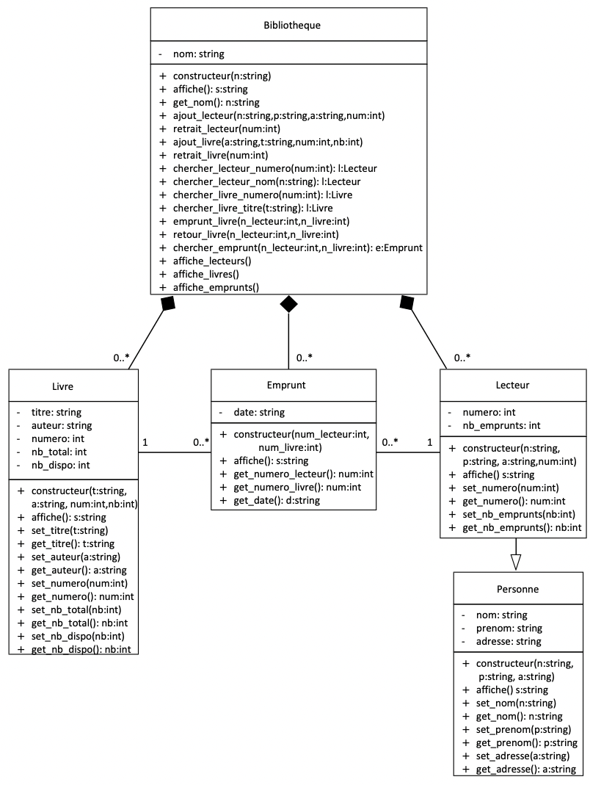

**Sommaire**

[[_TOC_]]

# TD #2 : Bibliothèque


__Ceci est la version enseignants incluant les corrections__

---
## Objectif du sujet

Dans ce TD, nous abordons deux concepts fondamentaux de la programmation orientée objet (POO), __l'encapsulation__ et la __composition__, qui ont été vus lors du premier cours. Nous nous exercerons également aux [diagrammes de classes](https://fr.wikipedia.org/wiki/Diagramme_de_classes) du langage graphique [UML](https://fr.wikipedia.org/wiki/UML_(informatique)). Pour vos propres diagrammes, vous pouvez utiliser [Visual paradigm](https://online.visual-paradigm.com/fr/) ou encore [diagrams.net](https://app.diagrams.net).

Il s'agit de concevoir et de réaliser un programme _simple_ de gestion d'une bibliothèque, intégrant des lecteurs, des livres et des emprunts.

_Remarque_ : Cet énoncé part d'un problème simple et connu qui permet d'en faire la conception et la réalisation dans le temps qui nous est imparti. Les choix de conception et de réalisation sont donc orientés par ces contraintes et par les objectifs pédagogiques, à savoir : apprendre la POO en _Python_. Il est clair que le même problème dans un cadre professionnel serait traité d’une autre manière et une solution basée sur des bases de données émergerait naturellement, solution que nous écartons a priori car en dehors du périmètre de ce cours.

---
## Cahier des charges

Le cahier des charges de notre application est décrit ci-dessous. Il est volontairement donné de manière informelle.

On doit pouvoir gérer le fond documentaire d'une bibliothèque identifiée par son nom. 

1. Notre application doit être capable de gérer des lecteurs. Chacun d’eux est caractérisé par :

     - Son nom,
     - Son prénom,
     - Son adresse,
     - Un numéro (entier positif attribué de manière unique par les bibliothécaires).

1. Pour simplifier, on considérera que tous les ouvrages sont des livres, caractérisés par :

     - Le nom de l’auteur,
     - Le titre de l’ouvrage,
     - Un numéro de livre (attribué de manière unique par les bibliothécaires),
     - Le nombre d’exemplaires achetés.

1. On doit pouvoir ajouter un lecteur à une bibliothèque à tout moment et rechercher un lecteur (par son numéro de lecteur et son nom). On doit également pouvoir ajouter des ouvrages (acquisition de livres), et rechercher un ouvrage (par son numéro de livre et son titre).   
1. Tout lecteur peut emprunter des livres à la bibliothèques. Un lecteur peut emprunter plusieurs livres différents simultanément ou à des dates différentes et un même livre peut être emprunté par plusieurs lecteurs (s’il existe plusieurs exemplaires). Au moment de l’emprunt, il faut donc vérifier qu’un exemplaire de l'ouvrage est bien disponible et qu'il n'a pas été emprunté par le même lecteur. De manière symétrique, il faut également gérer le retour des livres.

1. On désire également pouvoir visualiser des états détaillés :

    - Liste de tous les lecteurs d'une bibliothèque
    - Liste de tous les livres d'une bibliothèque
    - Liste de tous les emprunts d'une bibliothèque

1. On souhaite pouvoir retirer un lecteur (s'il n'a plus d'emprunt en cours), et retirer un exemplaire non emprunté d'un livre (désherbage ou vol). Un livre qui n'aurait plus d’exemplaire ne doit plus apparaître dans la liste des livres à disposition de la bibliothèque. 

_Remarque_ : Même si ce n'est pas pas obligatoire, il vous est demandé de développer chaque classe dans un fichier _Python_ séparé (pensez à enregistrer tous les fichiers dans le même répertoire).


---
## Modélisation UML (1 heure)

__Exercice 1 -__ Il s'agit de faire la conception de cette application en utilisant une approche objet. Dans ce cadre, il faut commencer par identifier les _concepts_ qui sont manipulés par l'application. On en déduit ainsi les objets manipulés par l'application qu’on généralise en terme de classes avec les attributs et les méthodes associés.
Il est donc demandé, à partir du cahier des charges, de faire la conception de cette application en utilisant la notation UML (diagramme de classes seulement). Il faudra alors faire apparaître clairement les classes, les relations entre classes et détailler les attributs et les méthodes de chaque classe.

---

<center class=correction><b>CORRECTION</b> </center>

__Point important__ : Il faut pousser les élèves vers la création d’une classe Emprunt car c’est la manière la plus élégante de mettre en oeuvre la relation “N-N” qui existe entre un Livre et un Lecteur (un livre peut être emprunté par plusieurs lecteurs et un même lecteur peut emprunter plusieurs livres). Cette classe permettra en outre de stocker la date de l'emprunt.

---
## Mise en oeuvre en Python (3 heures)

Nous allons maintenant développer en _Python_ les classes abordées précédemment. Il est vivement conseillé de faire un travail incrémental en ne développant que pas à pas chaque classe et en testant le code par des petits jeux d’essai (tests unitaires).

Pour chaque classe, on peut par exemple prévoir deux fichiers :
- Un fichier de définition de la classe (par exemple _lecteur.py_)
- Un fichier de test unitaire de la classe contenant un programme principal dont le rôle sera de tester toutes les fonctionnalités de la classe dans les différents contextes qui peuvent se présenter (par exemple _test_lecteur.py_)

L'ordre de développement des classes conseillé est le suivant : classe __Personne__, classe __Lecteur__, classe __Livre__, classe __Emprunt__, et finalement classe __Bibliotheque__.

__Exercice 2 : classe Personne -__ Ecrire le code de la classe __Personne__ dans un fichier _personne.py_. Vérifier ensuite le bon fonctionnement de cette classe en exécutant le code suivant préalablement copié dans un fichier _test_personne.py_.

``` python
# fichier test_personne.py
from personne import *

p = Personne("Durand","Marie","Ecully")

print(p)

p.set_nom("Dupond")
print(p.get_nom())
  
p.set_prenom("Emilie")
print(p.get_prenom())
    
p.set_adresse("Lyon")
print(p.get_adresse())    

print(p)
```

<b class=correction><b>CORRECTION : </b> Solution du fichier _personne.py_ :</b>

<div class=correction>

```python
class Personne:
    def __init__(self,nom,prenom,adresse):
        self.__nom = nom
        self.__prenom = prenom
        self.__adresse = adresse
        
    def __str__(self):
        return f"Classe Personne - Nom : {self.__nom}, Prenom : {self.__prenom}, Adresse : {self.__adresse}"
        
    def set_nom(self,nom):
        self.__nom = nom
        
    def get_nom(self):
        return self.__nom
        
    def set_prenom(self,prenom):
        self.__prenom = prenom
        
    def get_prenom(self):
        return self.__prenom
        
    def set_adresse(self,adresse):
        self.__adresse = adresse
        
    def get_adresse(self):
        return self.__adresse
```

__Exercice 3 : classe Lecteur -__ Ecrire le code de la classe __Lecteur__ dans un fichier _lecteur.py_. Vérifier ensuite le bon fonctionnement de cette classe en exécutant le code suivant préalablement copié dans un fichier _test_lecteur.py_.

``` python
# fichier test_lecteur.py
from lecteur import *

l = Lecteur("Durand","Marie","Ecully",13)

print(l)

l.set_nom("Dupond")
print(l.get_nom())

l.set_prenom("Emilie")
print(l.get_prenom())
    
l.set_adresse("Lyon")
print(l.get_adresse())   

l.set_numero(14)
print(l.get_numero())
        
l.set_nb_emprunts(2)
print(l.get_nb_emprunts())

print(l)
```

<b class=correction><b>CORRECTION : </b> Solution du fichier _lecteur.py_ :</b>

<div class=correction>

```python
from personne import *

# ***** classe Lecteur *****        
class Lecteur(Personne):
    def __init__(self,nom,prenom,adresse,numero):
        Personne.__init__(self,nom,prenom,adresse)        
        self.__numero = numero
        self.__nb_emprunts = 0
        
    def set_numero(self,numero):
        self.__numero = numero
        
    def get_numero(self):
        return self.__numero
        
    def set_nb_emprunts(self,nb_emprunts):
        self.__nb_emprunts = nb_emprunts
        
    def get_nb_emprunts(self):
        return self.__nb_emprunts
        
    def __str__(self): #Permet d'afficher les proprietes de l'objet avec la fonction print
        return 'Lecteur - Nom : {}, Prenom : {}, Adresse : {}, Numero : {}, Nb emprunts : {}'.format(self.get_nom(),self.get_prenom(),self.get_adresse(),self.__numero,self.__nb_emprunts)

```

__Exercice 4 : classe Livre -__ Ecrire le code de la classe __Livre__ dans un fichier _livre.py_. Vérifier ensuite le bon fonctionnement de cette classe en exécutant le code suivant préalablement copié dans un fichier _test_livre.py_.

``` python
# fichier test_livre.py
from livre import *

l = Livre('Le Pere Goriot','Honore de Balzac',101,2)
print(l)

l.set_auteur("Emilie Bronte")
print(l.get_auteur())
    
l.set_titre("Les Hauts de Hurlevent")
print(l.get_titre())
    
l.set_numero(102)
print(l.get_numero())

l.set_nb_total(5)
print(l.get_nb_total())

l.set_nb_dispo(4)
print(l.get_nb_dispo())

print(l)
```

<b class=correction><b>CORRECTION : </b> Solution du fichier _livre.py_ :</b>

<div class=correction>

```python
class Livre:
    def __init__(self,titre,auteur,numero,nb_total):
        self.__titre = titre        
        self.__auteur = auteur
        self.__numero = numero
        self.__nb_total = nb_total
        self.__nb_dispo = nb_total

    def set_auteur(self,auteur):
        self.__auteur = auteur
        
    def get_auteur(self):
        return self.__auteur
        
    def set_titre(self,titre):
        self.__titre = titre
        
    def get_titre(self):
        return self.__titre
        
    def set_numero(self,numero):
        self.__numero = numero
        
    def get_numero(self):
        return self.__numero
    
    def set_nb_total(self,nb_total):
        self.__nb_total = nb_total
        
    def get_nb_total(self):
        return self.__nb_total

    def set_nb_dispo(self,nb_dispo):
        self.__nb_dispo = nb_dispo
        
    def get_nb_dispo(self):
        return self.__nb_dispo
        
    def __str__(self):
        return 'Livre - Auteur : {}, Titre : {}, Numero : {}, Nb total : {}, Nb dispo : {}'.format(self.__auteur,self.__titre,self.__numero,self.__nb_total,self.__nb_dispo)

```

__Exercice 5 : classe Emprunt -__ Ecrire le code de la classe __Emprunt__ dans un fichier _emprunt.py_. Vérifier ensuite le bon fonctionnement de cette classe en exécutant le code suivant préalablement copié dans un fichier _test_emprunt.py_.

_Remarque_ : Pour la date figurant dans cette classe, on pourra utiliser l’instruction `date.isoformat(date.today())`, en ayant pris soin d'importer la librairie : `from datetime import date` (à positionner tout en haut du fichier).


``` python
# fichier test_emprunt.py
from emprunt import *

e = Emprunt(3,5)
print(e)

print(e.get_numero_lecteur())
print(e.get_numero_livre())
print(e.get_date())
```

<b class=correction><b>CORRECTION : </b> Solution du fichier _emprunt.py_ :</b>

<div class=correction>

```python
from datetime import date
from lecteur import *
from livre import *

# ***** classe Emprunt *****        
class Emprunt:
    def __init__(self,numero_lecteur,numero_livre):
        self.__numero_lecteur = numero_lecteur
        self.__numero_livre = numero_livre
        self.__date = date.isoformat(date.today())

    def get_numero_lecteur(self):
        return self.__numero_lecteur
        
    def get_numero_livre(self):
        return self.__numero_livre
        
    def get_date(self):
        return self.__date

    def __str__(self):
        return 'Emprunt - Numero lecteur : {}, Numero livre: {}, Date : {}'.format(self.__numero_lecteur,self.__numero_livre,self.__date)
  
```

__Exercice 6 : classe Bibliotheque -__ Ecrire finalement le code de la classe __Bibliotheque__ dans un fichier _bibliotheque.py_. Vérifier ensuite le bon fonctionnement de cette classe en exécutant le code suivant préalablement copié dans un fichier _test_bibliotheque.py_.


``` python
from bibliotheque import *

# Creation d'une bibliotheque
b = Bibliotheque('Bibliotheque ECL')

# Ajout de lecteurs
b.ajout_lecteur('Duval','Pierre','rue de la Paix',1)
b.ajout_lecteur('Dupond','Laurent','rue de la Gare',2)
b.ajout_lecteur('Martin','Marie','rue La Fayette',3)
b.ajout_lecteur('Dubois','Sophie','rue du Stade',4)

# Ajout de livres
b.ajout_livre('Le Pere Goriot','Honore de Balzac',101,2)
b.ajout_livre('Les Hauts de Hurlevent','Emilie Bronte',102,2)
b.ajout_livre('Le Petit Prince','Antoine de Saint Exupery',103,2)
b.ajout_livre('L\'Etranger','Albert Camus',104,2)

# Affichage des lecteurs et des livres
print('\n--- Liste des lecteurs :')
print('-------------------------------')
b.affiche_lecteurs()
print('\n--- Liste des livres :')
print('-------------------------------')
b.affiche_livres()

# Recherches de lecteurs par numero
print('\n--- Recherche de lecteurs :')
print('-------------------------------')
lect = b.chercher_lecteur_numero(1)
if lect != None:
    print(lect)
else:
    print('Lecteur non trouve')

lect = b.chercher_lecteur_numero(6)
if lect != None:
    print(lect)
else:
    print('Lecteur non trouve')

# Recherches de lecteurs par nom
lect = b.chercher_lecteur_nom('Martin','Marie')
if lect != None:
    print(lect)
else:
    print('Lecteur non trouve')
    
lect = b.chercher_lecteur_nom('Le Grand','Paul')
if lect != None:
    print(lect)
else:
    print('Lecteur non trouve')

# Recherches de livres par numero
print('\n--- Recherche de livres :')
print('-------------------------------')
livre = b.chercher_livre_numero(101)
if livre != None:
    print('Livre trouve :',livre)
else:
    print('Livre non trouve')

livre = b.chercher_livre_numero(106)
if livre != None:
    print('Livre trouve :',livre)
else:
    print('Livre non trouve')

# Recherches de livres par titre
livre = b.chercher_livre_titre('Les Hauts de Hurlevent')
if livre != None:
    print('Livre trouve :',livre)
else:
    print('Livre non trouve')

livre = b.chercher_livre_titre('Madame Bovarie')
if livre != None:
    print('Livre trouve :',livre)
else:
    print('Livre non trouve')

# Quelques emprunts
print('\n--- Quelques emprunts :')
print('-------------------------------')
b.emprunt_livre(1,101)
b.emprunt_livre(1,104)
b.emprunt_livre(2,101)
b.emprunt_livre(2,105)
b.emprunt_livre(3,101)
b.emprunt_livre(3,104)
b.emprunt_livre(4,102)
b.emprunt_livre(4,103)

# Affichage des emprunts, des lecteurs et des livres
print('\n--- Liste des emprunts :')
print('-------------------------------')
b.affiche_emprunts()
print('\n--- Liste des lecteurs :')
print('-------------------------------')
b.affiche_lecteurs()
print('\n--- Liste des livres :')
print('-------------------------------')
b.affiche_livres()

# Quelques retours de livres
print('\n--- Quelques retours de livres :')
print('-------------------------------')
b.retour_livre(1,101)
b.retour_livre(1,102)
b.retour_livre(3,104)
b.retour_livre(10,108)

# Affichage des emprunts, des lecteurs et des livres
print('\n--- Liste des emprunts :')
print('-------------------------------')
b.affiche_emprunts()
print('\n--- Liste des lecteurs :')
print('-------------------------------')
b.affiche_lecteurs()
print('\n--- Liste des livres :')
print('-------------------------------')
b.affiche_livres()

# Suppression de quelques livres
rep = b.retrait_livre(101)
if not rep:
    print('Retrait du livre impossible')
else:
    print('Retrait du livre effectue')

b.retour_livre(2,101)

rep = b.retrait_livre(101)
if not rep:
    print('Retrait du livre impossible')
else:
    print('Retrait du livre effectue')

# Suppression de quelques lecteurs
rep = b.retrait_lecteur(1)
if not rep:
    print('Retrait du lecteur impossible')
else:
    print('Retrait du lecteur effectue')

b.retour_livre(1,104)

rep = b.retrait_lecteur(1)
if not rep:
    print('Retrait du lecteur impossible')
else:
    print('Retrait du lecteur effectue')

# Affichage des emprunts, des lecteurs et des livres
print('\n--- Liste des emprunts :')
print('-------------------------------')
b.affiche_emprunts()
print('\n--- Liste des lecteurs :')
print('-------------------------------')
b.affiche_lecteurs()
print('\n--- Liste des livres :')
print('-------------------------------')
b.affiche_livres()
```

<b class=correction><b>CORRECTION : </b> Solution du fichier _bibliotheque.py_ :</b>

<div class=correction>

```python
from lecteur import *
from livre import *
from emprunt import *
    
      
# ***** classe Bibliotheque *****
class Bibliotheque:
    def __init__(self,nom):
        self.__nom = nom
        self.__lecteurs = []
        self.__livres = []
        self.__emprunts = []
        
    def get_nom(self):
        return self.__nom
        
    def ajout_lecteur(self,nom,prenom,adresse,numero):
        self.__lecteurs.append(Lecteur(nom,prenom,adresse,numero))
        
    def retrait_lecteur(self,numero):
        # On cherche le lecteur
        lecteur = self.chercher_lecteur_numero(numero)
        if lecteur == None:
            return False
        # On verifie qu'il n'a pas d'emprunt en cours
        for e in self.__emprunts:
            if e.get_numero_lecteur()==numero:
                return False
        # On peut ici retirer le lecteur de la liste
        self.__lecteurs.remove(lecteur)
        return True                
                
    def ajout_livre(self,auteur,titre,numero,nb_total):
        self.__livres.append(Livre(auteur,titre,numero,nb_total))
    
    def retrait_livre(self,numero):
        # On cherche le livre
        livre = self.chercher_livre_numero(numero)
        if livre == None:
            return False
        # On verifie que le livre n'est pas en cours d'emprunt
        for e in self.__emprunts:
            if e.get_numero_livre()==numero:
                return False
        # On peut ici retirer le livre de la liste
        self.__livres.remove(livre)
        return True        
        
    def chercher_lecteur_numero(self,numero):
        for l in self.__lecteurs:
            if l.get_numero() == numero:
                return l
        return None

    def chercher_lecteur_nom(self,nom,prenom):
        for l in self.__lecteurs:
            if l.get_nom() == nom and l.get_prenom() == prenom:
                return l
        return None    
        
    def chercher_livre_numero(self,numero):
        for l in self.__livres:
            if l.get_numero() == numero:
                return l
        return None

    def chercher_livre_titre(self,titre):
        for l in self.__livres:
            if l.get_titre() == titre:
                return l
        return None    
        
    def chercher_emprunt(self, numero_lecteur, numero_livre):
        for e in self.__emprunts:
            if e.get_numero_lecteur() == numero_lecteur and e.get_numero_livre() == numero_livre:
                return e
        return None

    def emprunt_livre(self, numero_lecteur, numero_livre):
        # On verifie que le numero de livre est valide
        livre = self.chercher_livre_numero(numero_livre)
        if livre == None:
            print('Emprunt impossible : livre inexistant')
            return None
            
        # On verifie qu'il reste des exemplaires disponibles pour ce livre
        if livre.get_nb_dispo() == 0:
            print('Emprunt impossible : plus d\'exemplaires disponibles')
            return None
            
        # On verifie que le numero de lecteur est valide
        lecteur = self.chercher_lecteur_numero(numero_lecteur)
        if lecteur == None:
            print('Emprunt impossible : lecteur inexistant')
            return None
        # On verifie que ce lecteur n'a pas deja emprunte ce livre
        e = self.chercher_emprunt(numero_lecteur, numero_livre)
        if e != None:
            print('Emprunt impossible : deja en cours')
            return None

        # Les conditions sont reunies pour pouvoir faire cet emprunt            
        self.__emprunts.append(Emprunt(numero_lecteur, numero_livre))
        livre.set_nb_dispo(livre.get_nb_dispo()-1)
        lecteur.set_nb_emprunts(lecteur.get_nb_emprunts()+1)
        return self.__emprunts[-1]

    def retour_livre(self, numero_lecteur, numero_livre):
        # On recherche l'emprunt identifie par le numero de livre et de lecteur
        e = self.chercher_emprunt(numero_lecteur, numero_livre)
        if e != None: # l'emprunt existe, on le retire de la liste et on met a jour nb_emprunt pour le lecteur et nb_dispo pour le livre
            self.__emprunts.remove(e)
            lecteur = self.chercher_lecteur_numero(numero_lecteur)
            if lecteur != None : lecteur.set_nb_emprunts(lecteur.get_nb_emprunts()-1)
            livre = self.chercher_livre_numero(numero_livre)
            if livre != None: livre.set_nb_dispo(livre.get_nb_dispo()+1)
            print('Retour effectue')
            return True
        else:
            print('Aucun emprunt ne correspond a ces informations')
            return False
        
    def affiche_lecteurs(self):
        for l in self.__lecteurs:
            print(l)

    def affiche_livres(self):
        for l in self.__livres:
            print(l)           
            
    def affiche_emprunts(self):
        for e in self.__emprunts:
            print(e)     
           
```

<div class=correction><b>CORRECTION</b> 

Le code complet est disponible [ICI](https://gitlab.ec-lyon.fr/edelland/inf_tc2-enseignant/-/tree/main/TD2/code).
