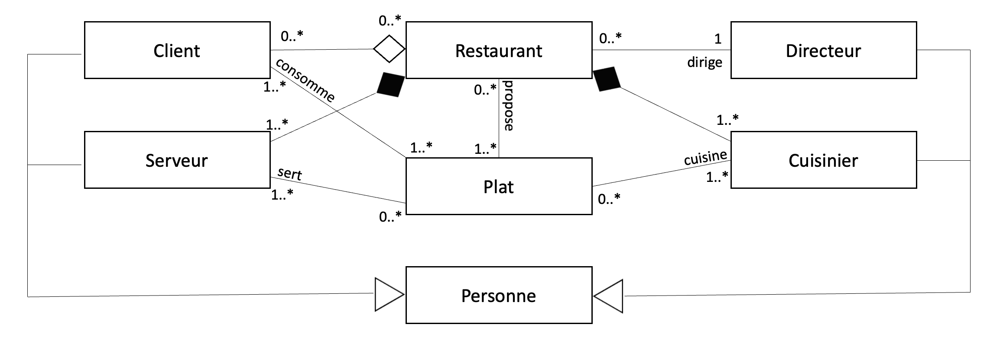
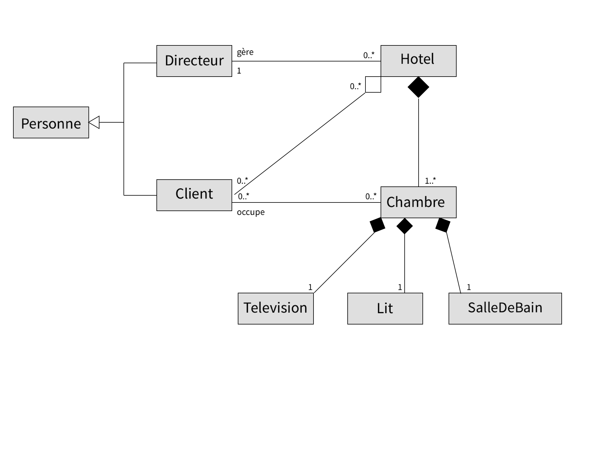
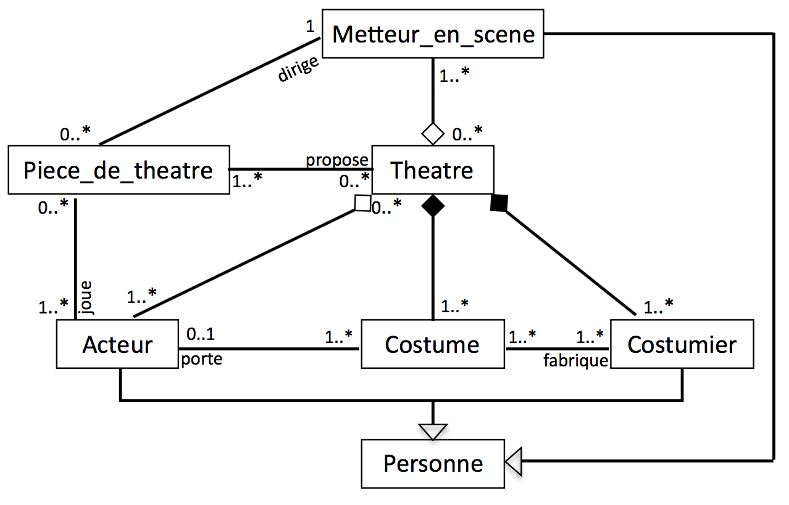
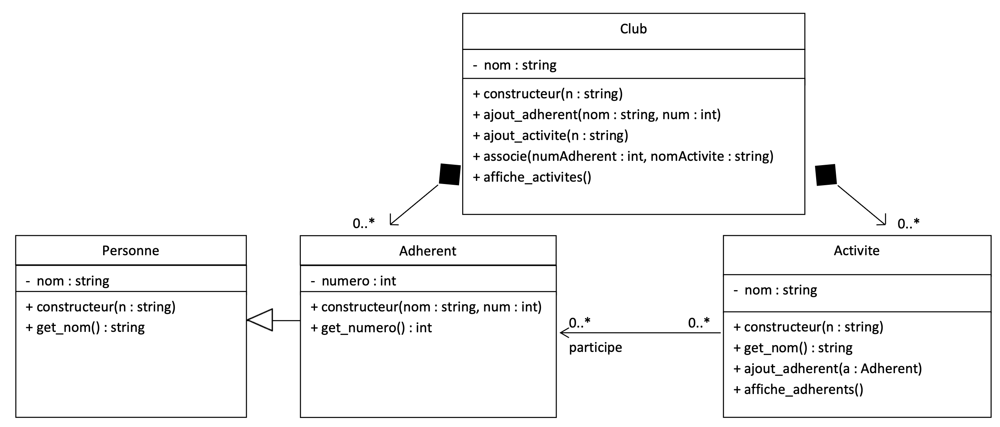

**Sommaire**

[[_TOC_]]

# TD #3 : Diagramme de classes UML et mise en oeuvre en Python

__Ceci est la version enseignants incluant les corrections__

---
## Objectif du sujet

L'objectif de ce TD (d'une durée de 2 heures) est 
- d'une part de s'entraîner à réaliser des modélisations objet à partir de cahiers des charges, en utilisant le diagramme de classes UML, 
- et d'autre part à écrire le code _Python_ d'une application mettant en oeuvre la modélisation objet exprimée dans le diagramme de classes.

Ainsi, dans une première partie (les trois premiers exercices), le travail consistera à utiliser la notation UML pour réaliser le diagramme de classes à partir d'un cahier des charges (ici réduit à un court texte mentionnant les entités à considérer). Ce diagramme de classes devra faîre apparaître les relations qui semblent pertinentes, sans définir les méthodes. Seul un attribut `nom` sera considéré pour chaque classe, en mode d'accès publique pour simplifier le code (exceptionnellement !).

Dans un second temps, le squelette de code en _Python_ correspondant au diagramme de classes devra être écrit en ajoutant aux classes uniquement le code du constucteur (`__init__`) et la méthode de conversion en chaîne de caractères (`__str__`). Le constructeur aura pour rôle d'initialiser l'attribut `nom` et d'éventuels attributs à ajouter en _Python_ déduits des relations entre classes mises en évidence dans le diagramme de classes (à initialiser à une valeur par défaut selon le type de l'attribut). La méthode de conversion `__str__` (utilisée notamment par la fonction `print`) devra permettre d'obtenir une chaîne de caractères indiquant la nature de la classe et la valeur de l'attribut `nom`. 

Cette première partie devrait durer environ 1h15.

La deuxième partie (donc d'environ 45 minutes) correspond à l'exercice 4. L'objectif ici est de partir d'un diagramme de classes UML plus complet, et d'écrire le code _Python_ correspondant.

A l'issue de ce TD, vous disposerez de 2h d'autonomie pour commencer le premier devoir à rendre pour `INF_TC2`. Ce travail et le compte-rendu (CR) pourront être réalisés seul ou en binôme. Veuillez bien prendre connaissance des consignes concernant le rendu du travail (à respecter scrupuleusement) qui se trouvent dans le fichier [consignes_TD3.md](./consignes_TD3.md), dans le même répertoire que cet énoncé.

## Exercice 1 : Restaurant

L'analyse d'une application _Restaurant_ a permis d'isoler les entités : __Restaurant__, __Personne__, __Directeur__, __Cuisinier__, __Serveur__, __Client__, __Plat__. 

1) Réalisez le diagramme de classes UML.

- __NB1.__ Les cuisiniers et serveurs ne travaillent que dans un seul restaurant.
- __NB2.__ Un client peut fréquenter plusieurs restaurants.
- __NB3.__ Un directeur peut diriger plusieurs restaurants.
- __NB4.__ Un restaurant ne peut être dirigé que par un seul directeur.

---    
<p class=correction>
<b>CORRECTION</b> 
</p>

<center></center>

2) Ecrivez en Python le squelette de l'application. Un programme principal devra également être écrit afin de tester l'ensemble des classes.

---    
<p class=correction>
<b>CORRECTION</b>
</p>

```python
#restaurant.py
class Personne:
    def __init__(self,nom):
        self.nom  = nom
        
    def __str__(self):
        return f"Classe Personne - nom : {self.nom}"

   
class Client(Personne):
    def __init__(self,nom):
        Personne.__init__(self, nom)
        self.restaurants = []
        self.plats = []
    
    def __str__(self):
        return f"Classe Client - nom : {self.nom}"

class Serveur(Personne):
    def __init__(self,nom):
        Personne.__init__(self, nom)
        self.restaurant = None
        self.plats = []
    
    def __str__(self):
        return f"Classe Serveur - nom : {self.nom}"

class Directeur(Personne):
    def __init__(self,nom):
        Personne.__init__(self, nom)
        self.restaurants = []
    
    def __str__(self):
        return f"Classe Directeur - nom : {self.nom}"
    
class Cuisinier(Personne):
    def __init__(self,nom):
        Personne.__init__(self, nom)
        self.restaurant = None
        self.plats = []
    
    def __str__(self):
        return f"Classe Cuisinier - nom : {self.nom}"
    
    
class Plat:
    def __init__(self,nom):
        self.nom = nom
        self.restaurants = []
        self.cuisiniers = []
        self.serveurs = []
        self.clients = []
    
    def __str__(self):
        return f"Classe Plat - nom : {self.nom}"   
    
class Restaurant:
    def __init__(self,nom):
        self.nom = nom
        self.directeur = None
        self.cuisiniers = []
        self.serveurs = []
        self.clients = []
        self.plats = []        
    
    def __str__(self):
        return f"Classe Restaurant - nom : {self.nom}"     
    
if __name__ == '__main__':
    
    p = Personne("Marie")
    print(p)
    
    cl = Client("Charles")
    print(cl)
    
    s = Serveur("Paul")
    print(s)
    
    d = Directeur("Maxime")
    print(d)
    
    cu = Cuisinier("Sabine")
    print(cu)
    
    p = Plat("Lasagnes")
    print(p)
    
    r = Restaurant("Chez Lulu")
    print(r)
```

## Exercice 2 : Hotel

On souhaite modéliser les connaissances suivantes : un hôtel est constitué de chambres et est géré par le directeur. L’hôtel héberge des clients. Chaque chambre est équipée d’un lit, d’une télévision et d’une salle de bain. 

1) Réalisez le diagrammes de classes UML.

---    
<p class=correction>
<b>CORRECTION</b> 
</p>

<center></center>

2) Ecrivez en Python le squelette de l'application. Un programme principal devra également être écrit afin de tester l'ensemble des classes.

---    
<p class=correction>
<b>CORRECTION</b>
</p>

```python
#hotel.py

class Personne:
    def __init__(self,nom):
        self.nom  = nom
        
    def __str__(self):
        return f"Classe Personne - nom : {self.nom}"

   
class Client(Personne):
    def __init__(self,nom):
        Personne.__init__(self, nom)
        self.hotels = []
        self.chambres = []
    
    def __str__(self):
        return f"Classe Client - nom : {self.nom}"

class Directeur(Personne):
    def __init__(self,nom):
        Personne.__init__(self, nom)
        self.hotels = []
    
    def __str__(self):
        return f"Classe Directeur - nom : {self.nom}"

class Television:
    def __init__(self,nom):
        self.nom  = nom
        self.chambre = None
        
    def __str__(self):
        return f"Classe Television - nom : {self.nom}"

class Lit:
    def __init__(self,nom):
        self.nom  = nom
        self.chambre = None
        
    def __str__(self):
        return f"Classe Lit - nom : {self.nom}"

class Salle_de_bain:
    def __init__(self,nom):
        self.nom  = nom
        self.chambre = None
        
    def __str__(self):
        return f"Classe Salle_de_bain - nom : {self.nom}"     
    
class Chambre:
    def __init__(self,nom,hotel,nom_tele,nom_lit,nom_sdb):
        self.nom  = nom
        self.hotel = hotel
        self.clients = []
        self.television = Television(nom_tele)
        self.lit = Lit(nom_lit)
        self.salle_de_bain = Salle_de_bain(nom_sdb)
        
    def __str__(self):
        return f"Classe Chambre - nom : {self.nom}"
     
    
class Hotel:
    def __init__(self,nom):
        self.nom = nom
        self.directeur = None
        self.clients = []
        self.chambres = []        
    
    def __str__(self):
        return f"Classe Hotel - nom : {self.nom}"     
    
if __name__ == '__main__':
    
    p = Personne("Marie")
    print(p)
    
    cl = Client("Charles")
    print(cl)
    
    d = Directeur("Maxime")
    print(d)
    
    h = Hotel("L'Europeen")
    print(h)
    
    sdb = Salle_de_bain("Ocean")
    print(sdb)
    
    t = Television("Tashibo")
    print(t)
    
    l = Lit("Confort")
    print(l)
    
    ch = Chambre("101",h,"Samsing","Relax","Plage")
    print(ch)
```

## Exercice 3 : Théatre

L’analyse d’une application de gestion d’un "théâtre" a permis d’isoler les entités suivantes : Theatre, Acteur, Metteur_en_scene, Costumier, Costume, Piece_de_theatre, Personne. 

1) Réalisez le diagrammes de classes UML.

- __NB1.__	Un acteur peut jouer dans plusieurs théâtres et dans plusieurs pièces.
- __NB2.__	Un metteur en scène peut travailler dans plusieurs théâtres et diriger plusieurs pièces.
- __NB3.__ Les costumes appartiennent à un seul théâtre.
- __NB4.__	Les costumiers ne travaillent que dans un seul théâtre.

---    
<p class=correction>
<b>CORRECTION</b> 
</p>

<center></center>

2) Ecrivez en Python le squelette de l'application. Un programme principal devra également être écrit afin de tester l'ensemble des classes.

---    
<p class=correction>
<b>CORRECTION</b>
</p>

```python
#theatre.py

class Personne:
    def __init__(self,nom):
        self.nom  = nom
        
    def __str__(self):
        return f"Classe Personne - nom : {self.nom}"

   
class Acteur(Personne):
    def __init__(self,nom):
        Personne.__init__(self, nom)
        self.theatres = []
        self.costumes = []
        self.pieces_de_theatre = []
    
    def __str__(self):
        return f"Classe Acteur - nom : {self.nom}"

class Costumier(Personne):
    def __init__(self,nom):
        Personne.__init__(self, nom)
        self.theatre = None
        self.costumes = []
    
    def __str__(self):
        return f"Classe Costumier - nom : {self.nom}"

class Metteur_en_scene(Personne):
    def __init__(self,nom):
        Personne.__init__(self, nom)
        self.theatres = []
        self.pieces_de_theatre = []
    
    def __str__(self):
        return f"Classe Metteur_en_scene - nom : {self.nom}"
        
class Piece_de_theatre:
    def __init__(self,nom):
        self.nom = nom
        self.theatres = []
        self.acteurs = []
        self.metteur_en_scene = None
    
    def __str__(self):
        return f"Classe Piece_de_theatre - nom : {self.nom}"   

class Costume:
    def __init__(self,nom):
        self.nom = nom
        self.theatre = None
        self.acteurs = []
        self.costumiers = []     
    
    def __str__(self):
        return f"Classe Costume - nom : {self.nom}"     
    
class Theatre:
    def __init__(self,nom):
        self.nom = nom
        self.metteurs_en_scene = []
        self.pieces_de_theatre = []
        self.acteurs = []
        self.costumiers = []        
        self.costumes = []
        
    def __str__(self):
        return f"Classe Theatre - nom : {self.nom}"     
    
if __name__ == '__main__':
    
    p = Personne("Marie")
    print(p)
    
    a = Acteur("Charles")
    print(a)
    
    c = Costumier("Paul")
    print(c)
    
    m = Metteur_en_scene("Delphine")
    print(m)
    
    pi = Piece_de_theatre("Hamlet")
    print(pi)
    
    co = Costume("Chique")
    print(co)
    
    t = Theatre("La Comédie Française")
    print(t)
```

## Exercice 4 : Club

La modélisation d'une application de gestion d'un _Club_ a abouti au diagramme de classes suivant :

<center></center>

Ecrivez en _Python_ le code correspondant, ainsi qu'un programme principal permettant de tester toutes les classes.

---    
<p class=correction>
<b>CORRECTION</b>
</p>

```python
#club.py
class Personne:
	def __init__(self,nom):
		self.__nom = nom

	def get_nom(self):
		return self.__nom

class Adherent(Personne):
	def __init__(self,nom,num):
		Personne.__init__(self,nom)
		self.__numero = num

	def get_numero(self):
		return	self.__numero

class Activite:
	def __init__(self,n):
		self.__nom = n
		self.__adherents = []

	def get_nom(self):
		return self.__nom

	def ajout_adherent(self,a):
		self.__adherents.append(a)

	def affiche_adherents(self):
		print('Liste des adherents:')
		for a in self.__adherents:
			print(f"Nom : {a.get_nom()} - Numero : {a.get_numero()}")

class Club:
	def __init__(self,n):
		self.__nom = n
		self.__adherents = []
		self.__activites = []

	def ajout_adherent(self,nom,num):
		self.__adherents.append(Adherent(nom,num))

	def ajout_activite(self,n):
		self.__activites.append(Activite(n))

	def associe(self,numAdherent,nomActivite):
		trouveAc = False
		for ac in self.__activites:
			if ac.get_nom() == nomActivite:
				trouveAc = True 
				break

		trouveAd = False
		for ad in self.__adherents:
			if ad.get_numero() == numAdherent:
				trouveAd = True 
				break

		if trouveAc and trouveAd:
			ac.ajout_adherent(ad)

	def affiche_activites(self):
		print('Liste des activites:')
		for a in self.__activites:
			print('- Nom :',a.get_nom())
			a.affiche_adherents()

if __name__ == '__main__':
	c = Club('Ecully')
	c.ajout_adherent('Paul',1)
	c.ajout_adherent('Marc',2)
	c.ajout_adherent('Marie',3)

	c.ajout_activite('Escalade')
	c.ajout_activite('Theatre')
	c.ajout_activite('Football')

	c.associe(1,'Theatre')
	c.associe(2,'Theatre')
	c.associe(3,'Theatre')

	c.associe(2,'Escalade')
	c.associe(3,'Escalade')

	c.affiche_activites()
```

## Devoir à rendre

Forts de cet entraînement, le travail correspondant au premier devoir à rendre de `INF_TC2` consiste à prendre en considération le cahier des charges suivant, qui est un enrichissement de celui utilisé dans le TD #2 traitant de la modélisation d'une Bibliothèque.

Ainsi, les éléments supplémentaires à ajouter à la modélisation précédente sont les suivants :

La bibliothèque est dirigée par un unique conservateur.

Un certain nombre de bibliothécaires travaillent à la bibliothèque. Ceux-ci sont dotés d'un numéro unique, et parmi leurs rôles, ils ont en charge l'enregistrement des emprunts. Pour chaque emprunt, il est donc nécessaire de pouvoir identifier le livre, le lecteur, ainsi que le bibiothécaire ayant fait l'enregistrement.

On doit donc également pouvoir associer la bibliothèque au conservateur (et réciproquement), ainsi qu'ajouter, supprimer et rechercher des bibliothécaires. Enfin, il doit être possible de visualiser l'état détaillé de l'ensemble des bibliothécaires de la bibliothèque.

Le travail consiste donc à compléter le diagramme de classes UML du TD #2 en ajoutant les éléments nécessaires, puis de compléter le code _Python_, sans oublier de faire les tests pertinents pour vérifier que le programme fonctionne correctement.

Rappel : les modalités de rendus sont précisées dans le fichier [consignes_TD3.md](./consignes_TD3.md), dans le même répertoire que cet énoncé.