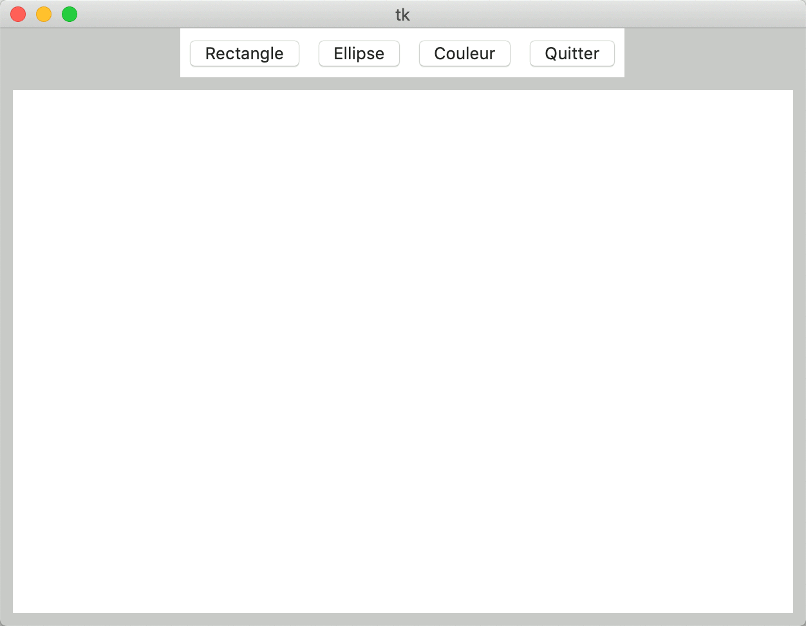
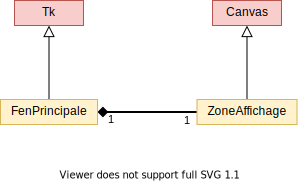
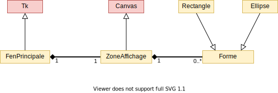

**Sommaire**

[[_TOC_]]

# TD #4 : Application de dessin vectoriel

<p class=correction>
    Ceci est la "version enseignants" du TD #4 incluant les solutions aux questions posées. Ce TD propose d'implémenter une application de dessin vectoriel à la souris pour utiliser les formes développées au TD #1.
</p>

L'objectif de ce TD est d'apprendre à manipuler quelques composants du module _Python_ _Tkinter_ permettant de créer des interfaces graphiques. Vous allez créer une application simple de dessin vectoriel, qui permettra de tracer à la souris les formes définies dans le TD #1.

---
## Quelques éléments sur _Tkinter_ (45 min.)

Le module _Tkinter_ (_"Tk interface"_) permet de créer des interfaces graphiques. Il contient de nombreux composants graphiques (ou _widgets_), tels que les boutons (classe __Button__), les cases à cocher (classe __CheckButton__), les étiquettes (classe __Label__), les zones d'entrée de texte (classe __Entry__), les menus (classe __Menu__), ou les zones de dessin (classe __Canvas__).

Durant ce TD, nous vous recommandons de conserver le lien vers une [documentation sur _Tkinter_]( https://python.doctor/page-tkinter-interface-graphique-python-tutoriel) ouverte dans un onglet de votre navigateur. Elle contient des exemples de code qui vous seront utiles pour utiliser chacun des _widgets_.

Voici un premier exemple de code _Tkinter_ :

```python
from tkinter import *
from random import randint

class FenPrincipale(Tk):
    def __init__(self):
        Tk.__init__(self)
        
        # paramètres de la fenêtre
        self.title('Tirage aléatoire')
        self.geometry('300x100+400+400')
        
        # constitution de l'interface
        boutonLancer = Button(self, text='Tirage')
        boutonLancer.pack(side=LEFT, padx=5, pady=5)
        self.__texteResultat = StringVar()
        labelResultat = Label(self, textvariable=self.__texteResultat)
        labelResultat.pack(side=LEFT, padx=5, pady=5)
        boutonQuitter = Button(self, text='Quitter')
        boutonQuitter.pack(side=LEFT, padx=5, pady=5)
        
        # association des widgets aux fonctions
        boutonLancer.config(command=self.tirage) # appel "callback" (pas de parenthèses !)
        boutonQuitter.config(command=self.destroy)  # idem
    
    # tire un entier au hasard et l'affiche dans self.__texteResultat
    def tirage(self):
        nb = randint(1, 100)
        self.__texteResultat.set('Nombre : ' + str(nb))


if __name__ == '__main__':
    app = FenPrincipale()
    app.mainloop()
```

*Remarque :* La méthode `pack(...)` est utilisée pour organiser les différents éléments dans la fenêtre.

__Exercice 1 -__ Copiez le code précédent dans un fichier appelé *exo1.py* et exécutez-le pour observer le résultat. 

__Attention, utilisateurs de Mac__ : l'association _Spyder_+_Tkinter_ ne fonctionne pas toujours bien sous Mac ! Lorsque vous quitterez l'interface (par le biais du bouton _Quitter_), la fenêtre peut se bloquer (_freeze_). Deux solutions: 

- soit vous forcez l'application à s'arrêter à chaque fois (utilisez le menu contextuel sur l'icône de l'application concernée dans la barre d'outils);     
- soit vous exécutez votre programme en ligne de commande. Pour cela, ouvrez un `Terminal` dans le répertoire de travail (clic-droit sur le répertoire → Nouveau terminal au dossier). Puis lancez le programme exécutant la commande : `python3 exo1.py`. Vous devriez pouvoir quitter l'application sans difficulté. N'oubliez pas de sauvegarder votre fichier sous _Spyder_ avant toute exécution de cette manière !

Prenez le temps d'étudier cet exemple, et répondez aux questions suivantes :

* Combien d'éléments contient l'interface ?
* Que se passe-t-il lorsqu'on clique sur le bouton `Tirage` ?
* Comment peut-on inverser les positions des deux boutons ?
* Comment peut-on augmenter l'espace à gauche et à droite du label ?
* Comment peut-on colorier le texte du label en rouge ?


---
## Squelette de l'application de dessin (60 min.)

On souhaite obtenir l'interface ci-dessous, dans laquelle les utilisateurs sélectionneront le type de forme à dessiner avec les boutons, et créeront une forme en cliquant dans la zone située sous la barre d'outils (_widget_ __Canvas__ de _Tkinter_). On a donné une couleur grise au fond de la fenêtre pour vous aider à déterminer les différents _widgets_ présents.

<center></center>

Pour réaliser une telle interface graphique, nous allons introduire deux classes :

* la classe __ZoneAffichage__, qui hérite de __Canvas__ et gère toutes les opérations de dessin spécifiques à votre application.
* la classe __FenPrincipale__, qui hérite de __Tk__ et gère l'initialisation de l'interface et des _callbacks_ des _widgets_.

Voici le diagramme UML correspondant :

<center></center>

En rouge figure les classes de la librairie _Tkinter_, et en jaune vos propres classes.

__Exercice 2 -__ Complétez le code ci-dessous. Vous utiliserez une instance de __ZoneAffichage__ pour implémenter le canevas. À ce stade, on ne vous demande pas de programmer les actions associées aux boutons, mais uniquement de mettre en place le design de l'interface. Vous trouverez des exemples d'utilisation de chacun des _widgets_ dans la documentation référencée plus haut.

```python
from tkinter import *

class ZoneAffichage(Canvas):
    def __init__(self, parent, largeur, hauteur):
        Canvas.__init__(self, parent, width=largeur, height=hauteur)

class FenPrincipale(Tk):
    def __init__(self):
        Tk.__init__(self)
        self.configure(bg="grey")
        # L'initialisation de l'interface se fait ici

if __name__ == "__main__":
    fen = FenPrincipale()
    fen.mainloop()
```

---    
<p class=correction>
<b>Éléments de réponse pour les enseignants</b>
</p>

Une difficulté ici est de penser à passer `self` comme argument au constructeur de __ZoneAffichage__, pour que cette zone d'affichage référence la fenêtre dans laquelle elle a été incluse.

```python
from tkinter import *

class ZoneAffichage(Canvas):
    def __init__(self, parent, largeur, hauteur):
        Canvas.__init__(self, parent, width=largeur, height=hauteur)

class FenPrincipale(Tk):
    def __init__(self):
        Tk.__init__(self)
        self.configure(bg="grey")
        
        barreOutils = Frame(self)
        barreOutils.pack(side=TOP)
        
        boutonRectangle = Button(barreOutils, text="Rectangle")
        boutonRectangle.pack(side=LEFT, padx=5, pady=5)
        boutonEllipse = Button(barreOutils, text="Ellipse")
        boutonEllipse.pack(side=LEFT, padx=5, pady=5)
        boutonCouleur = Button(barreOutils, text="Couleur")
        boutonCouleur.pack(side=LEFT, padx=5, pady=5)
        boutonQuitter = Button(barreOutils, text="Quitter")
        boutonQuitter.pack(side=LEFT, padx=5, pady=5)

        # pour quitter proprement
        boutonQuitter.config(command=self.destroy)
        
        canevas = ZoneAffichage(self, 600, 400)
        canevas.pack(side=TOP, padx=10, pady=10)

if __name__ == "__main__":
    fen = FenPrincipale()
    fen.mainloop()
```


---
## Dessin de formes dans le canevas (75 min.)

Vous trouverez dans le dossier de ce TD le fichier [formes.py](formes.py) développé durant le TD #1. Nous avons agrémenté les classes __Rectangle__ et __Ellipse__ pour qu'elles reçoivent un canevas en argument et se dessinent dessus lors de leur initialisation. La classe __Forme__ est maintenant dotée d'une méthode `effacer()` qui supprimera la forme du canevas.

Copiez ce fichier dans votre répertoire de travail.

Ces classes seront intégrées selon le diagramme UML suivant :

<center></center>

__Exercice 3 -__ À l'aide de la méthode `bind` (cf documentation), reliez les clics de la souris dans le canevas (événements `<ButtonRelease-1>`) à une nouvelle méthode de __ZoneAffichage__ qui imprime les coordonnées de chaque clic avec `print`.

__Exercice 4 -__ Modifiez cette méthode pour créer un nouveau __Rectangle__ centré sur la souris chaque fois que la méthode est exécutée (à ce stade choisissez des dimensions arbitraires). N'oubliez pas de stocker ce rectangle dans __ZoneAffichage__ !

__Exercice 5 -__ Lorsqu'on clique sur le bouton `Ellipse`, l'outil "Ellipse" est sélectionné et tous les futurs clics dans le canevas doivent créer une nouvelle __Ellipse__ (de dimension fixe quelconque). Lorsqu'on clique ensuite sur le bouton `Rectangle`, les clics suivants créeront un __Rectangle__. L'outil sélectionné par défaut est "Rectangle". Modifiez votre code pour implémenter ce comportement.

---    
<p class=correction><b>Éléments de réponse pour les enseignants</b></p>

On a utilisé l'événement `<ButtonRelease-1>` plutôt que `<Button-1>` pour ne pas interférer avec l'appui-déplacement proposé dans les exercices bonus. Enfin une difficulté ici est de penser à définir un attribut (privé) `self.__canevas`, car cet attribut est utilisé dans `clic_canevas(...)`.

```python
from tkinter import *
from formes import *

class ZoneAffichage(Canvas):
    def __init__(self, master, largeur, hauteur):
        Canvas.__init__(self, master, width=largeur, height=hauteur)
        self.__formes = []
        self.__type_forme = 'rectangle'
    
    def selection_rectangle(self):
        self.__type_forme = 'rectangle'
    
    def selection_ellipse(self):
        self.__type_forme = 'ellipse'
    
    def ajout_forme(self, x, y):
        # Notez qu'on aurait aussi pu ajouter ce code en méthodes de Rectangle/Ellipse.
        if self.__type_forme == 'rectangle':
            f = Rectangle(self, x, y, 10, 20, "brown")
        elif self.__type_forme == 'ellipse':
            f = Ellipse(self, x, y, 5, 10, "brown")
        self.__formes.append(f)


class FenPrincipale(Tk):
    def __init__(self):
        Tk.__init__(self)
        
        # interface
        self.configure(bg="grey")
        barreOutils = Frame(self)
        barreOutils.pack(side=TOP)
        boutonRectangle = Button(barreOutils, text="Rectangle")
        boutonRectangle.pack(side=LEFT, padx=5, pady=5)
        boutonEllipse = Button(barreOutils, text="Ellipse")
        boutonEllipse.pack(side=LEFT, padx=5, pady=5)
        boutonCouleur = Button(barreOutils, text="Couleur")
        boutonCouleur.pack(side=LEFT, padx=5, pady=5)
        boutonQuitter = Button(barreOutils, text="Quitter")
        boutonQuitter.pack(side=LEFT, padx=5, pady=5)
        self.__canevas = ZoneAffichage(self, 600, 400)
        self.__canevas.pack(side=TOP, padx=10, pady=10)
        
        # commandes
        boutonRectangle.config(command=self.__canevas.selection_rectangle)
        boutonEllipse.config(command=self.__canevas.selection_ellipse)
        boutonQuitter.config(command=self.destroy)
        self.__canevas.bind("<ButtonRelease-1>", self.release_canevas)
    
    def release_canevas(self, event):
        self.__canevas.ajout_forme(event.x, event.y)


if __name__ == '__main__':
    fen = FenPrincipale()
    fen.mainloop()
```

---
## Opérations de dessin supplémentaires (60 min.)

Nous allons à présent intégrer deux commandes simples dans l'application de dessin :

* Lorsqu'on clique sur une forme en maintenant la touche CTRL enfoncée, elle doit s'effacer du canevas.
* Lorsqu'on clique sur le bouton _Couleur_, un sélecteur de couleurs apparaît pour choisir la couleur de l'outil de dessin.

__Exercice 6 -__ Implémentez l'effacement des formes avec CTRL-clic (événement `<Control-ButtonRelease-1>`). Vous pourrez faire appel aux méthodes `contient_point(...)` des classes __Rectangle__ et __Ellipse__ pour déterminer si la position de la souris au moment de l'événement est dans le périmètre d'une forme donnée, ainsi qu'à la méthode `effacer(...)` de la classe __Forme__.

__Exercice 7 -__ À l'aide du module _colorchooser_ de _Tkinter_ (```from tkinter import colorchooser```), liez les clics sur le bouton _Couleur_ à l'affichage d'un sélecteur de couleur, et utilisez la couleur renvoyée pour tous les ajouts de formes suivants.

---

<p class=correction><b>Éléments de réponse pour les enseignants</b> </p>

Il est important d'arriver à l'exercice 6 qui traite pleinement du polymorphisme (et impossible de finauder pour l'éviter). Dans ce même exercice, pour éviter de modifier la liste des formes pendant qu'on itère dessus, on peut recommander de faire en deux temps : (i) chercher l'index d'une forme contenant le point, (ii) la retirer de la liste si trouvée.

Lors du test du CTRL-clic, il faut bien vérifier que lorsque deux formes se chevauchent on supprime uniquement celle du dessus.

```python
from tkinter import *
from tkinter import colorchooser # doit être importé manuellement
from formes import *

class ZoneAffichage(Canvas):
    def __init__(self, master, largeur, hauteur):
        Canvas.__init__(self, master, width=largeur, height=hauteur)
        self.__formes = []
        self.__type_forme = 'rectangle'
        self.__couleur = 'brown'
    
    def selection_rectangle(self):
        self.__type_forme = 'rectangle'
    
    def selection_ellipse(self):
        self.__type_forme = 'ellipse'
    
    def selection_couleur(self):
        self.__couleur = colorchooser.askcolor()[1]
    
    def ajout_forme(self, x, y):
        # Notez qu'on aurait aussi pu ajouter ce code en méthodes de Rectangle/Ellipse.
        if self.__type_forme == 'rectangle':
            f = Rectangle(self, x-5, y-10, 10, 20, self.__couleur)
        elif self.__type_forme == 'ellipse':
            f = Ellipse(self, x, y, 5, 10, self.__couleur)
        self.__formes.append(f)
    
    def suppression_forme(self, x, y):
        for f in self.__formes[::-1]:
            if f.contient_point(x, y):
                self.__formes.remove(f)
                f.effacer()
                break


class FenPrincipale(Tk):
    def __init__(self):
        Tk.__init__(self)
        
        # interface
        self.configure(bg="grey")
        barreOutils = Frame(self)
        barreOutils.pack(side=TOP)
        boutonRectangle = Button(barreOutils, text="Rectangle")
        boutonRectangle.pack(side=LEFT, padx=5, pady=5)
        boutonEllipse = Button(barreOutils, text="Ellipse")
        boutonEllipse.pack(side=LEFT, padx=5, pady=5)
        boutonCouleur = Button(barreOutils, text="Couleur")
        boutonCouleur.pack(side=LEFT, padx=5, pady=5)
        boutonQuitter = Button(barreOutils, text="Quitter")
        boutonQuitter.pack(side=LEFT, padx=5, pady=5)
        self.__canevas = ZoneAffichage(self, 600, 400)
        self.__canevas.pack(side=TOP, padx=10, pady=10)
        
        # commandes
        boutonRectangle.config(command=self.__canevas.selection_rectangle)
        boutonEllipse.config(command=self.__canevas.selection_ellipse)
        boutonCouleur.config(command=self.__canevas.selection_couleur)
        boutonQuitter.config(command=self.destroy)
        self.__canevas.bind("<Control-ButtonRelease-1>", self.control_clic_canevas)
        self.__canevas.bind("<ButtonRelease-1>", self.release_canevas)
    
    def control_clic_canevas(self, event):
        self.__canevas.suppression_forme(event.x, event.y)
    
    def release_canevas(self, event):
        self.__canevas.ajout_forme(event.x, event.y)


if __name__ == '__main__':
    fen = FenPrincipale()
    fen.mainloop()
```


---
## Exercices bonus

Il n'y a pas d'ordre prédéfini pour ces trois exercices supplémentaires, choisissez celui dont la fonctionnalité vous semble la plus intéressante.

__Bonus 1 -__ Dans tout programme de dessin respectable, on doit pouvoir dessiner des formes de tailles arbitraires (pas prédéfinies comme précédemment). À l'aide des types d'événements `<Button-1>`, `<B1-Motion>` et `<ButtonRelease-1>`, faites qu'un mouvement de souris avec le bouton enfoncé dessine une forme en tirant ses coins (lorsqu'il ne déplace pas une forme existante). Vous pourrez utiliser les méthodes `redimension_par_points(...)` des classes __Rectangle__ et __Ellipse__.
  
<p class=correction><b>Correction, cf fichier code/PartieBonus_1.py</b></p>

__Bonus 2 -__ Il serait aussi pratique de pouvoir déplacer les formes présentes sur le canevas. À l'aide des types d'événements `<Button-1>`, `<B1-Motion>` et `<ButtonRelease-1>`, implémentez la translation des formes lors des actions d'appui-déplacement de la souris. Comment faire pour qu'elles n'interfèrent pas avec la création de nouvelles formes ?
   
<p class=correction><b>Correction, cf fichier code/PartieBonus_2.py</b></p>

__Bonus 3 -__ Maintenant que votre programme de dessin vectoriel est fonctionnel, on doit pouvoir exporter chaque image produite dans un fichier. On utilise pour cela le format SVG, qui est un fichier texte contenant des instructions de dessin. Il suffit d'écrire `<svg viewBox="0 0 600 400" xmlns="http://www.w3.org/2000/svg">` au début du fichier, `</svg>` à la fin, et d'insérer des balises [`rect`](https://developer.mozilla.org/fr/docs/Web/SVG/Element/rect) et [`ellipse`](https://developer.mozilla.org/fr/docs/Web/SVG/Element/ellipse) entre les deux. Pour obtenir un dessin coloré, vous pouvez insérer à l'intérieur des 2 balises, la chaîne `style="fill: brown"` et remplacer `brown` par la couleur de votre forme. C'est maintenant à vous de jouer !

<p class=correction><b>Correction, cf fichier code/PartieBonus_3.py</b></p>